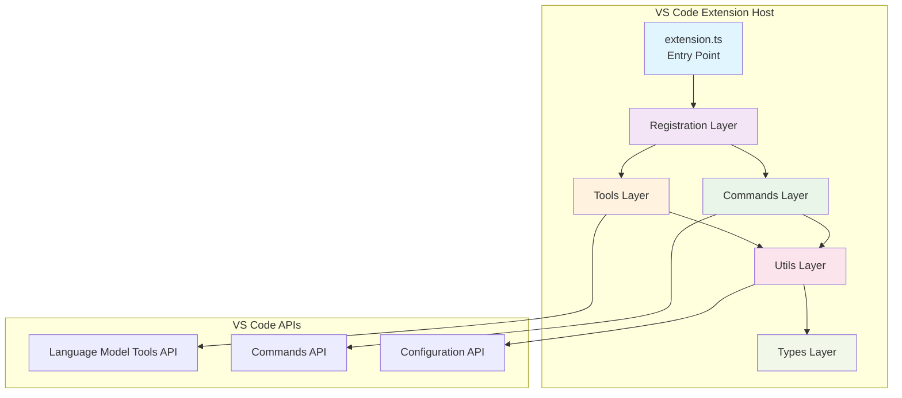
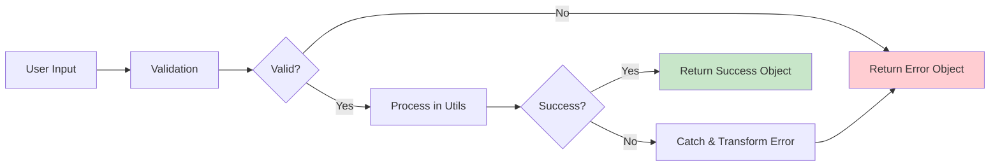

# AI Watch Extension Architecture

This document describes the modular architecture of the AI Watch VS Code extension after the major refactoring from a monolithic structure to a clean, maintainable codebase.

## Overview

AI Watch is a VS Code extension that provides 8 date/time tools for AI assistants through the Language Model Tools API. The extension follows a modular architecture with clear separation of concerns.

## High-Level Architecture



## Module Structure

The extension is organized into 6 main layers:

### 1. Entry Point (`src/extension.ts`)
- **Purpose**: VS Code extension activation/deactivation with namespace exports
- **Responsibilities**: Delegate to registration modules and provide organized exports
- **Size**: ~40 lines (reduced from 1,800+ lines)
- **Export Structure**: Namespace-based exports prevent naming conflicts

```typescript
// Organized namespace exports
export * as Types from './types';
export * as Tools from './tools';
export * as Commands from './commands';
export * as Utils from './utils';
```

### 2. Types Layer (`src/types/`)
- **Purpose**: TypeScript interfaces and type definitions with compile-time safety
- **Modules**:
  - `options.ts` - Command option interfaces with union types
  - `parameters.ts` - Language Model Tool parameter interfaces
  - `results.ts` - Return type interfaces
  - `index.ts` - Barrel export

**Type Safety Features:**
- Union types for `VerbosityLevel`: `'compact' | 'standard' | 'verbose'`
- Union types for `DurationUnit`: `'milliseconds' | 'seconds' | 'minutes' | 'hours' | 'days'`
- Compile-time validation prevents runtime errors
- Exported types enable type-safe integration

### 3. Utils Layer (`src/utils/`)
- **Purpose**: Core business logic and utility functions with robust error handling
- **Modules**:
  - `dateUtils.ts` - Date/time operations and weekday parsing
  - `timezoneUtils.ts` - Timezone formatting with custom format support
  - `durationUtils.ts` - Duration formatting with negative sign preservation and type safety
  - `dateQueryUtils.ts` - Date queries (next/previous weekday, periods)
  - `businessDayUtils.ts` - Business day calculations with wrap-around support
  - `index.ts` - Barrel export

**Enhanced Features:**
- Negative duration handling with proper sign preservation
- Zero duration edge case handling (prevents "-0s" outputs)
- Type-safe function signatures with union types
- Comprehensive error handling and validation

### 4. Commands Layer (`src/commands/`)
- **Purpose**: VS Code command implementations
- **Modules**: 9 focused command files, each handling one operation
- **Pattern**: Each command validates input, calls utils, returns structured results

### 5. Tools Layer (`src/tools/`)
- **Purpose**: Language Model Tool implementations
- **Modules**: 9 tool classes implementing `vscode.LanguageModelTool`
- **Pattern**: Each tool handles AI assistant integration with invoke/prepare methods

### 6. Registration Layer (`src/registration/`)
- **Purpose**: Register commands and tools with VS Code
- **Modules**:
  - `commands.ts` - Command registration
  - `tools.ts` - Language Model Tool registration
  - `index.ts` - Barrel export

## Detailed Module Dependencies

```mermaid
graph TD
    subgraph "Entry Point"
        EXT[extension.ts]
    end

    subgraph "Registration"
        REG_CMD[commands.ts]
        REG_TOOLS[tools.ts]
        REG_IDX[index.ts]
    end

    subgraph "Commands"
        CMD_GET[getCurrentDate.ts]
        CMD_CALC[calculateDifference.ts]
        CMD_CONV[convertTimezone.ts]
        CMD_ADD[addTime.ts]
        CMD_SUB[subtractTime.ts]
        CMD_FMT[formatDuration.ts]
        CMD_BIZ[businessDay.ts]
        CMD_QRY[dateQuery.ts]
        CMD_IDX[index.ts]
    end

    subgraph "Tools"
        TOOL_GET[getCurrentDateTool.ts]
        TOOL_CALC[calculateDifferenceTool.ts]
        TOOL_CONV[convertTimezoneTool.ts]
        TOOL_ADD[addTimeTool.ts]
        TOOL_SUB[subtractTimeTool.ts]
        TOOL_FMT[formatDurationTool.ts]
        TOOL_BIZ[businessDayTool.ts]
        TOOL_QRY[dateQueryTool.ts]
        TOOL_IDX[index.ts]
    end

    subgraph "Utils"
        UTIL_DATE[dateUtils.ts]
        UTIL_TZ[timezoneUtils.ts]
        UTIL_DUR[durationUtils.ts]
        UTIL_QRY[dateQueryUtils.ts]
        UTIL_BIZ[businessDayUtils.ts]
        UTIL_IDX[index.ts]
    end

    subgraph "Types"
        TYPE_OPT[options.ts]
        TYPE_PAR[parameters.ts]
        TYPE_IDX[index.ts]
    end

    EXT --> REG_IDX
    REG_IDX --> REG_CMD
    REG_IDX --> REG_TOOLS

    REG_CMD --> CMD_IDX
    REG_TOOLS --> TOOL_IDX

    CMD_IDX --> CMD_GET
    CMD_IDX --> CMD_CALC
    CMD_IDX --> CMD_CONV
    CMD_IDX --> CMD_ADD
    CMD_IDX --> CMD_SUB
    CMD_IDX --> CMD_FMT
    CMD_IDX --> CMD_BIZ
    CMD_IDX --> CMD_QRY

    TOOL_IDX --> TOOL_GET
    TOOL_IDX --> TOOL_CALC
    TOOL_IDX --> TOOL_CONV
    TOOL_IDX --> TOOL_ADD
    TOOL_IDX --> TOOL_SUB
    TOOL_IDX --> TOOL_FMT
    TOOL_IDX --> TOOL_BIZ
    TOOL_IDX --> TOOL_QRY

    CMD_GET --> UTIL_IDX
    CMD_CALC --> UTIL_IDX
    CMD_CONV --> UTIL_IDX
    CMD_ADD --> UTIL_IDX
    CMD_SUB --> UTIL_IDX
    CMD_FMT --> UTIL_IDX
    CMD_BIZ --> UTIL_IDX
    CMD_QRY --> UTIL_IDX

    TOOL_GET --> UTIL_IDX
    TOOL_CALC --> UTIL_IDX
    TOOL_CONV --> UTIL_IDX
    TOOL_ADD --> UTIL_IDX
    TOOL_SUB --> UTIL_IDX
    TOOL_FMT --> UTIL_IDX
    TOOL_BIZ --> UTIL_IDX
    TOOL_QRY --> UTIL_IDX

    UTIL_IDX --> UTIL_DATE
    UTIL_IDX --> UTIL_TZ
    UTIL_IDX --> UTIL_DUR
    UTIL_IDX --> UTIL_QRY
    UTIL_IDX --> UTIL_BIZ

    UTIL_BIZ --> UTIL_DATE
    UTIL_QRY --> UTIL_DATE

    CMD_GET --> TYPE_IDX
    CMD_CALC --> TYPE_IDX
    CMD_CONV --> TYPE_IDX
    CMD_ADD --> TYPE_IDX
    CMD_SUB --> TYPE_IDX
    CMD_FMT --> TYPE_IDX
    CMD_BIZ --> TYPE_IDX
    CMD_QRY --> TYPE_IDX

    TOOL_GET --> TYPE_IDX
    TOOL_CALC --> TYPE_IDX
    TOOL_CONV --> TYPE_IDX
    TOOL_ADD --> TYPE_IDX
    TOOL_SUB --> TYPE_IDX
    TOOL_FMT --> TYPE_IDX
    TOOL_BIZ --> TYPE_IDX
    TOOL_QRY --> TYPE_IDX

    TYPE_IDX --> TYPE_OPT
    TYPE_IDX --> TYPE_PAR
```



## Data Flow

```mermaid
sequenceDigram
    participant User as AI Assistant
    participant VSCode as VS Code
    participant Tool as Language Model Tool
    participant Command as Command
    participant Utils as Utils Layer

    User->>VSCode: Request date operation
    VSCode->>Tool: invoke(parameters)
    Tool->>Command: Call command function
    Command->>Utils: Use utility functions
    Utils-->>Command: Return processed data
    Command-->>Tool: Return structured result
    Tool->>VSCode: Return LanguageModelToolResult
    VSCode-->>User: Display formatted response
```

## Key Architectural Patterns

### 1. Barrel Exports
Each layer uses `index.ts` files to create clean, centralized exports:

```typescript
// src/utils/index.ts
export * from './dateUtils';
export * from './timezoneUtils';
export * from './durationUtils';
export * from './dateQueryUtils';
export * from './businessDayUtils';
```

### 2. Separation of Concerns
- **Commands**: Handle VS Code command API integration
- **Tools**: Handle AI Language Model Tool API integration
- **Utils**: Pure business logic, no VS Code dependencies
- **Types**: Shared interfaces across layers

### 3. Dependency Injection Pattern
Higher-level modules depend on abstractions (interfaces) from the Types layer, not concrete implementations.

### 4. Single Responsibility Principle
Each module has one clear purpose:
- `dateUtils.ts`: Core date operations
- `timezoneUtils.ts`: Timezone-specific formatting
- `durationUtils.ts`: Duration formatting only
- etc.

## Error Handling Strategy



### Error Handling Layers:
1. **Input Validation**: Type checking and format validation
2. **Utility Layer**: Business logic error handling
3. **Command/Tool Layer**: Error transformation and user-friendly messages
4. **Consistent Error Format**: All errors return `{ error: string }` objects

## Testing Strategy

The modular architecture enables comprehensive testing across multiple layers:

### Test Organization

- **Utils Tests**: Core business logic functions tested in isolation
- **Command Tests**: VS Code command implementations and integration
- **Tool Tests**: Language Model Tool functionality and validation
- **Integration Tests**: End-to-end extension workflow testing

### Test Coverage

Comprehensive test suite covering all layers:

- **Utility Layer**:
  - `dateUtils.test.ts` - Date parsing, formatting, and calculations
  - `businessDayUtils.test.ts` - Business day logic and exclusions
  - `durationUtils.test.ts` - Duration formatting and verbosity
  - `dateQueryUtils.test.ts` - Advanced date queries and period calculations
  - `timezoneUtils.test.ts` - Timezone conversions and DST handling
  - `index.test.ts` - Barrel export validation

- **Command Layer**:
  - `getCurrentDate.test.ts` - Current date command with timezone support
  - `addTime.test.ts` - Time addition with multiple units
  - `allCommands.test.ts` - All command implementations and edge cases

# AI Watch Extension Architecture

This document describes the current modular architecture of the AI Watch VS Code extension after the recent overhaul. It reflects the implementation under `src/modules` and the registration wiring. Test-related content is intentionally omitted.

## Overview

AI Watch provides 8 date/time capabilities as both VS Code commands and Language Model Tools. The codebase is organized by feature modules, with a small registration layer and a thin entry point.

## High-level layout

```text
src/
    extension.ts                # Entry point: activation/deactivation
    registration/               # Wiring for commands and LM tools
        index.ts
        commands.ts               # Registers VS Code commands
        tools.ts                  # Registers Language Model Tools (lm.registerTool)
    modules/
        <feature>/                # One folder per capability (e.g., add-time, date-query)
            index.ts                # Barrel for the feature
            command/                # Command implementation(s)
            lm-tool/                # Language Model Tool implementation(s)
            model/                  # Options/Result types for the feature
        shared/                   # Reusable errors/models/utils across features
            error/
            model/
            util/
```

## Runtime wiring

- Entry point (`src/extension.ts`)
    - Calls `registerChatTools(context)` and `registerCommands(context)` during `activate`.
    - Deactivation relies on VS Code disposing subscriptions automatically.

- Registration layer (`src/registration/`)
    - `commands.ts`: binds command IDs (e.g., `ai-watch.addTime`) to module command functions.
    - `tools.ts`: registers LM Tools (e.g., `ai-watch_addTime`) for the Language Model Tools API.

- Modules (`src/modules/`)
    - Feature-scoped folders encapsulate:
        - command: pure command functions (validate → compute → return typed result)
        - lm-tool: VS Code Language Model Tool classes bridging AI agents to the command layer
        - model: TypeScript option/result interfaces used by both command and tool
    - `shared/` module provides cross-cutting utilities and types:
        - `util/timezoneUtils.ts`: timezone formatting, custom format application, local/UTC helpers
        - `util/dateUtils.ts`: parsing, weekday normalization, duration description
        - `error/*`: rich, specific error types
        - `model/OperationContext.ts`: collects informational messages surfaced in results

## Data flow (commands vs tools)

- Commands
    - Invoked via `vscode.commands.executeCommand('ai-watch.<cmd>', options)`
    - Return typed JSON results directly (no VS Code UI coupling)

- Language Model Tools
    - Registered via `lm.registerTool('<tool_name>', new <ToolClass>())`
    - Call the same command functions under the hood
    - Provide LM-friendly output structure; agents surface JSON first and may include a short human message

## Feature modules at a glance

- current-date-time: get current date/time with timezone and optional formatting
- add-time / subtract-time: arithmetic on dates using date-fns (years…seconds)
- convert-timezone: convert a timestamp to a target IANA timezone
- calculate-difference: difference between two instants (ms + formatted)
- format-duration: human-readable durations using date-fns interval formatting
- business-day: weekday/business-day math with exclusions and custom calendars
- date-query: navigation (next/previous weekday) and period boundaries (start/end of week/month/quarter/year)

All modules expose their public entry via their feature `index.ts` and a central `modules/index.ts` barrel.

## Configuration touchpoints

Configuration is read from the `aiWatch` namespace via VS Code’s workspace configuration:

- `defaultDateFormat` (string): global default formatting pattern when no explicit format is provided.
- `businessDays` (string[]): custom business-day set for business-day math.
- `excludedDates` (string[]): YYYY-MM-DD dates excluded from business-day calculations.
- `weekStart` (string | number): week start used by period queries and weekday normalization.
- `durationFormat` ("compact" | "standard" | "verbose"): default verbosity for `formatDuration`.
- `maxDurationUnits` (number): default maximum units for `formatDuration` (1–6).

These are consumed in module code (e.g., `timezoneUtils`, `businessDayCommand`, `dateQueryCommand`, `formatDurationCommand`). Per-invocation parameters override configuration.

## Error handling

- Specific error classes (e.g., `InvalidDateError`, `InvalidTimezoneError`, `InvalidWeekDayError`) provide precise failure reasons.
- Commands throw errors on invalid inputs; LM tools and callers can surface messages alongside the structured result.
- `OperationContext` collects non-fatal info strings (e.g., which timezone or format was applied).

## Extending the extension

To add a new capability:
1. Create `src/modules/<new-feature>/` with `command/`, `lm-tool/`, and `model/` folders and an `index.ts` barrel.
2. Implement the command function(s) in `command/` and types in `model/`.
3. Implement a Language Model Tool class in `lm-tool/` that calls the command.
4. Export from `src/modules/<new-feature>/index.ts` and add to `src/modules/index.ts`.
5. Register the VS Code command in `src/registration/commands.ts` and the LM tool in `src/registration/tools.ts`.

This feature-first structure keeps code cohesive and discoverable, with shared concerns centralized under `modules/shared`.

## Summary

The current architecture is:
- Feature-first (`src/modules/<feature>`): command + tool + model per capability
- Thin registration layer: predictable wiring to VS Code APIs
- Thin entry point: just activation/deactivation
- Centralized shared utilities and error types

This design makes features easy to add, behavior easy to reason about, and integration with AI assistants straightforward.
