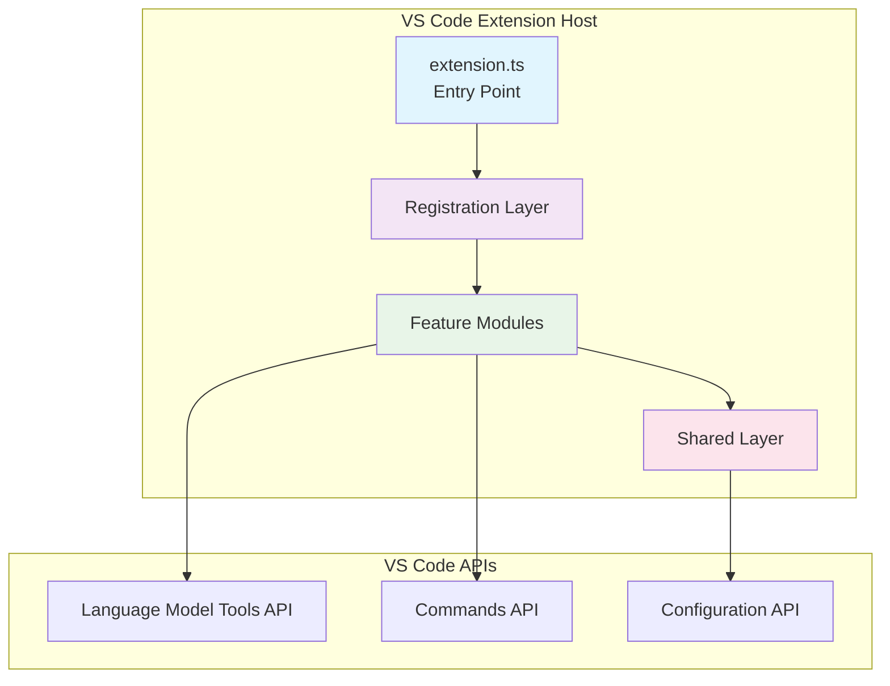
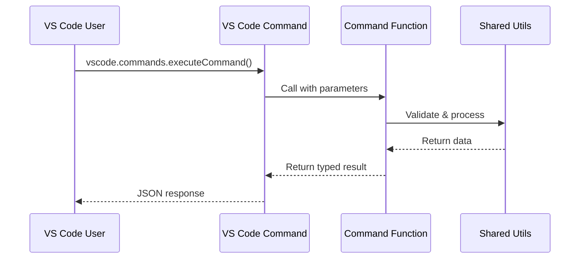
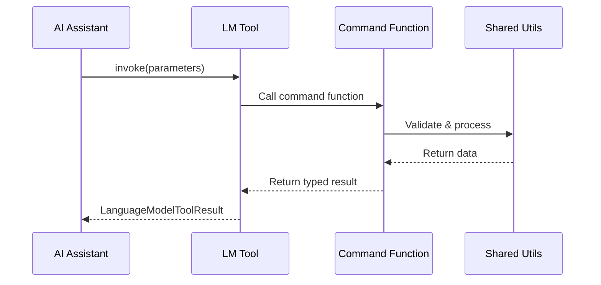
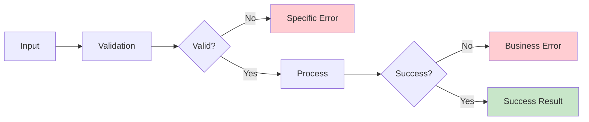

# AI Watch Extension Architecture

This document describes the modular, feature-first architecture of the AI Watch VS Code extension as designed for its initial public release.

## Overview

AI Watch provides a suite of date and time capabilities as both VS Code commands and Language Model Tools. The codebase is organized by feature modules, with a small registration layer and a thin entry point.

## High-Level Architecture



## Directory Structure

```text
src/
    extension.ts                # Entry point: activation/deactivation
    registration/               # Wiring for commands and LM tools
        index.ts
        commands.ts               # Registers VS Code commands
        tools.ts                  # Registers Language Model Tools (lm.registerTool)
    modules/
        <feature>/                # One folder per capability (e.g., add-time, date-query)
            index.ts                # Barrel for the feature
            command/                # Command implementation(s)
            lm-tool/                # Language Model Tool implementation(s)
            model/                  # Options/Result types for the feature
        shared/                   # Reusable errors/models/utils across features
            error/
            model/
            util/
```

## Core Components

### 1. Entry Point (`src/extension.ts`)
- **Purpose**: VS Code extension activation/deactivation
- **Responsibilities**: Delegate to registration modules

```typescript
export function activate(context: ExtensionContext) {
  registerCommands(context);
  registerChatTools(context);
}

export function deactivate() {
  // VS Code handles cleanup automatically
}
```

### 2. Registration Layer (`src/registration/`)
- **Purpose**: Wire commands and tools to VS Code APIs
- **Modules**:
  - `commands.ts` - Registers VS Code commands (e.g., `ai-watch.addTime`)
  - `tools.ts` - Registers Language Model Tools (e.g., `ai-watch_addTime`)
  - `index.ts` - Main registration entry point

```typescript
// Example command registration
vscode.commands.registerCommand('ai-watch.addTime', addTimeCommand);

// Example tool registration
vscode.lm.registerTool('ai-watch_addTime', new AddTimeTool());
```

### 3. Feature Modules (`src/modules/<feature>/`)
- **Purpose**: Feature-scoped encapsulation
- **Structure**: Each feature contains:
  - `command/` - Pure command functions (validate → compute → return)
  - `lm-tool/` - Language Model Tool classes bridging AI to commands
  - `model/` - TypeScript interfaces for options and results
  - `index.ts` - Feature barrel export

**Current Features:**
- `add-time` / `subtract-time` - Date arithmetic using date-fns
- `current-date-time` - Current time with timezone support
- `convert-timezone` - IANA timezone conversion
- `calculate-difference` - Time difference calculations
- `format-duration` - Human-readable duration formatting
- `business-day` - Business day math with exclusions
- `date-query` - Date navigation and period boundaries

### 4. Shared Layer (`src/modules/shared/`)
- **Purpose**: Cross-cutting concerns and utilities
- **Components**:
  - `util/timezoneUtils.ts` - Timezone formatting and custom formats
  - `util/dateUtils.ts` - Date parsing, weekday normalization
  - `error/` - Specific error classes (InvalidDateError, etc.)
  - `model/OperationContext.ts` - Info message collection

## Data Flow Patterns

### Command Execution


### Language Model Tool Execution


## Architectural Patterns

### 1. Feature-First Organization
Each capability is self-contained within its module:
- Independent development and testing
- Clear boundaries between features
- Easy to add new capabilities
- Simplified maintenance

### 2. Dual Interface Pattern
Every feature provides both:
- **VS Code Command**: Direct programmatic access
- **Language Model Tool**: AI assistant integration

### 3. Shared Core Pattern
Common functionality centralized in `shared/`:
- Prevents code duplication
- Ensures consistent behavior
- Simplifies testing and maintenance

### 4. Barrel Exports
Each module uses `index.ts` for clean imports:

```typescript
// src/modules/add-time/index.ts
export { addTimeCommand } from './command/addTimeCommand';
export { AddTimeTool } from './lm-tool/addTimeTool';
export type { AddTimeOptions, AddTimeResult } from './model';

// Usage elsewhere
import { addTimeCommand, AddTimeOptions } from '../modules/add-time';
```

## Configuration Integration

Configuration is read from VS Code's `aiWatch` namespace:

- `defaultDateFormat` - Global date format pattern
- `businessDays` - Custom business day definitions
- `excludedDates` - Holiday/shutdown exclusions
- `weekStart` - Week start day for period calculations
- `durationFormat` - Default verbosity level
- `maxDurationUnits` - Default unit limit

Configuration flows through the system:
1. Commands read VS Code settings
2. Per-call parameters override defaults
3. Shared utilities apply effective values

## Error Handling Strategy



**Error Types:**
- `InvalidDateError` - Date parsing failures
- `InvalidTimezoneError` - Invalid IANA timezone
- `InvalidWeekDayError` - Invalid weekday name
- `MissingDaysError` - Required business day parameter missing
- etc.

**Error Flow:**
1. **Input Validation**: Type and format checking
2. **Business Logic**: Domain-specific validation
3. **Error Transformation**: User-friendly messages
4. **Consistent Format**: Structured error responses

## Testing Architecture

The modular design enables focused testing:

### Test Organization
```text
src/test/
├── commands/                 # Command integration tests
├── tools/                   # LM tool functionality tests
├── utils/                   # Shared utility unit tests
└── (integration tests)      # End-to-end workflows
```

### Testing Strategy
- **Unit Tests**: Shared utilities tested in isolation
- **Integration Tests**: Command/tool implementations
- **End-to-End Tests**: Full extension workflows
- **Document-Driven**: Tests aim to validate API documentation as the primary goal, but comprehensive coverage—including lower-level logic and edge cases—is also important. Some tests may target implementation details when it improves reliability or coverage.

## Extension Points

### Adding New Features

**Recommended Workflow for Adding New Features**

> _Note: This is the recommended workflow. The process is naturally iterative—you may not know all error states or the final options/results structure before development. It's encouraged to think ahead, but it's normal to revise types, errors, and documentation as you go. Maintain good practices throughout the process._

1. **Design the API First**
  - Define the feature’s purpose, inputs, and outputs.
  - Draft TypeScript types for options and results (e.g., `NewFeatureOptions`, `NewFeatureResult`).
  - Add a provisional entry to `API_REFERENCE.md`.

2. **Define Error Types**
  - Identify and create new error types as needed (in `src/modules/shared/error/`).
  - Document them for clarity.

3. **Create Module Structure**:
  ```bash
  mkdir src/modules/new-feature
  mkdir src/modules/new-feature/{command,lm-tool,model}
  ```

4. **Implement Core Logic**:
  ```typescript
  // src/modules/new-feature/command/newFeatureCommand.ts
  export function newFeatureCommand(options: NewFeatureOptions): NewFeatureResult {
    // Implementation
  }
  ```

5. **Create LM Tool (if needed)**
  ```typescript
  // src/modules/new-feature/lm-tool/newFeatureTool.ts
  export class NewFeatureTool implements vscode.LanguageModelTool {
    // Implementation
  }
  ```

6. **Register with System**
  ```typescript
  // In src/registration/commands.ts and tools.ts
  registerCommand('ai-watch.newFeature', newFeatureCommand);
  registerTool('ai-watch_newFeature', new NewFeatureTool());
  ```

7. **Write Tests**
  - Add unit, integration, and (if needed) end-to-end tests.
  - Ensure tests aim to validate the documented API, but allow for implementation detail coverage when it improves reliability or covers edge cases.

8. **Update Documentation**
  - Finalize API docs, user guide, and configuration docs as needed.


**Note:** When adding a new command or Language Model Tool, update `package.json` as required by VS Code:
  - Add new commands to the `contributes.commands` section.
  - Add new tools to the appropriate `contributes` or activation events if needed.
  - Ensure command IDs, titles, and categories are clear and consistent.
  - Update any other relevant fields (e.g., menus, keybindings) to expose the new feature in the UI.

### Extending Shared Utilities

Add new utilities to `src/modules/shared/util/` following the same patterns:
- Pure functions with no VS Code dependencies
- Comprehensive error handling
- Type-safe interfaces
- Barrel exports through `shared/index.ts`

## Performance Considerations

### Lazy Loading
- Modules only load when first used
- Registration happens at activation
- Minimal startup overhead

### Memory Efficiency
- Stateless design prevents memory leaks
- No global state or caching
- Garbage collection friendly

### Bundle Size
- Feature modules can be tree-shaken
- Shared utilities minimize duplication
- External dependencies carefully managed

## Best Practices

### Module Design
1. **Single Responsibility**: Each module handles one capability
2. **Clean Interfaces**: Type-safe options and results
3. **Error Handling**: Specific, actionable error messages
4. **Documentation**: JSDoc for all functions (not just public)—prefer documenting everything for maximum clarity

### Code Organization
1. **Consistent Structure**: All features follow same pattern
2. **Barrel Exports**: Clean import/export boundaries
3. **Dependency Direction**: Features depend on shared, not vice versa
4. **Configuration**: Settings override built-in defaults

### Testing
1. **Layer Isolation**: Test each layer independently
2. **Document Validation**: Tests match API documentation
3. **Timezone Safety**: UTC-based test assertions
4. **Error Coverage**: Test both success and failure paths

## Summary

AI Watch's current architecture prioritizes:
- **Modularity**: Feature-first organization
- **Maintainability**: Clear separation of concerns
- **Extensibility**: Easy to add new capabilities
- **Reliability**: Comprehensive error handling and testing

This design enables rapid development of new time/date features while maintaining code quality and system stability.
