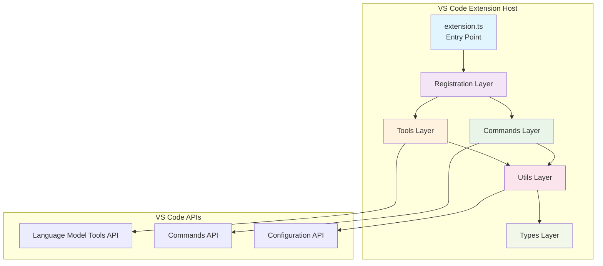
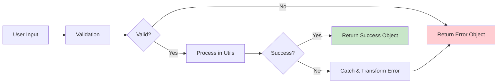
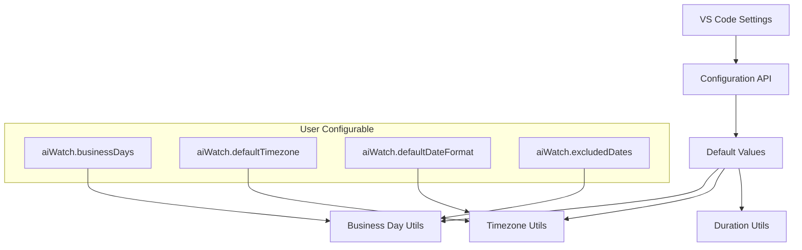

# AI Watch Extension Architecture

This document describes the modular architecture of the AI Watch VS Code extension after the major refactoring from a monolithic structure to a clean, maintainable codebase.

## Overview

AI Watch is a VS Code extension that provides 8 date/time tools for AI assistants through the Language Model Tools API. The extension follows a modular architecture with clear separation of concerns.

## High-Level Architecture



## Module Structure

The extension is organized into 6 main layers:

### 1. Entry Point (`src/extension.ts`)
- **Purpose**: VS Code extension activation/deactivation
- **Responsibilities**: Delegate to registration modules
- **Size**: ~50 lines (reduced from 1,800+ lines)

### 2. Types Layer (`src/types/`)
- **Purpose**: TypeScript interfaces and type definitions
- **Modules**:
  - `options.ts` - Command option interfaces
  - `parameters.ts` - Language Model Tool parameter interfaces
  - `index.ts` - Barrel export

### 3. Utils Layer (`src/utils/`)
- **Purpose**: Core business logic and utility functions
- **Modules**:
  - `dateUtils.ts` - Date/time operations and weekday parsing
  - `timezoneUtils.ts` - Timezone formatting with custom format support
  - `durationUtils.ts` - Duration formatting in multiple verbosity levels
  - `dateQueryUtils.ts` - Date queries (next/previous weekday, periods)
  - `businessDayUtils.ts` - Business day calculations with wrap-around support
  - `index.ts` - Barrel export

### 4. Commands Layer (`src/commands/`)
- **Purpose**: VS Code command implementations
- **Modules**: 9 focused command files, each handling one operation
- **Pattern**: Each command validates input, calls utils, returns structured results

### 5. Tools Layer (`src/tools/`)
- **Purpose**: Language Model Tool implementations
- **Modules**: 9 tool classes implementing `vscode.LanguageModelTool`
- **Pattern**: Each tool handles AI assistant integration with invoke/prepare methods

### 6. Registration Layer (`src/registration/`)
- **Purpose**: Register commands and tools with VS Code
- **Modules**:
  - `commands.ts` - Command registration
  - `tools.ts` - Language Model Tool registration
  - `index.ts` - Barrel export

## Detailed Module Dependencies

```mermaid
graph TD
    subgraph "Entry Point"
        EXT[extension.ts]
    end

    subgraph "Registration"
        REG_CMD[commands.ts]
        REG_TOOLS[tools.ts]
        REG_IDX[index.ts]
    end

    subgraph "Commands"
        CMD_GET[getCurrentDate.ts]
        CMD_CALC[calculateDifference.ts]
        CMD_CONV[convertTimezone.ts]
        CMD_ADD[addTime.ts]
        CMD_SUB[subtractTime.ts]
        CMD_FMT[formatDuration.ts]
        CMD_BIZ[businessDay.ts]
        CMD_QRY[dateQuery.ts]
        CMD_IDX[index.ts]
    end

    subgraph "Tools"
        TOOL_GET[getCurrentDateTool.ts]
        TOOL_CALC[calculateDifferenceTool.ts]
        TOOL_CONV[convertTimezoneTool.ts]
        TOOL_ADD[addTimeTool.ts]
        TOOL_SUB[subtractTimeTool.ts]
        TOOL_FMT[formatDurationTool.ts]
        TOOL_BIZ[businessDayTool.ts]
        TOOL_QRY[dateQueryTool.ts]
        TOOL_IDX[index.ts]
    end

    subgraph "Utils"
        UTIL_DATE[dateUtils.ts]
        UTIL_TZ[timezoneUtils.ts]
        UTIL_DUR[durationUtils.ts]
        UTIL_QRY[dateQueryUtils.ts]
        UTIL_BIZ[businessDayUtils.ts]
        UTIL_IDX[index.ts]
    end

    subgraph "Types"
        TYPE_OPT[options.ts]
        TYPE_PAR[parameters.ts]
        TYPE_IDX[index.ts]
    end

    EXT --> REG_IDX
    REG_IDX --> REG_CMD
    REG_IDX --> REG_TOOLS

    REG_CMD --> CMD_IDX
    REG_TOOLS --> TOOL_IDX

    CMD_IDX --> CMD_GET
    CMD_IDX --> CMD_CALC
    CMD_IDX --> CMD_CONV
    CMD_IDX --> CMD_ADD
    CMD_IDX --> CMD_SUB
    CMD_IDX --> CMD_FMT
    CMD_IDX --> CMD_BIZ
    CMD_IDX --> CMD_QRY

    TOOL_IDX --> TOOL_GET
    TOOL_IDX --> TOOL_CALC
    TOOL_IDX --> TOOL_CONV
    TOOL_IDX --> TOOL_ADD
    TOOL_IDX --> TOOL_SUB
    TOOL_IDX --> TOOL_FMT
    TOOL_IDX --> TOOL_BIZ
    TOOL_IDX --> TOOL_QRY

    CMD_GET --> UTIL_IDX
    CMD_CALC --> UTIL_IDX
    CMD_CONV --> UTIL_IDX
    CMD_ADD --> UTIL_IDX
    CMD_SUB --> UTIL_IDX
    CMD_FMT --> UTIL_IDX
    CMD_BIZ --> UTIL_IDX
    CMD_QRY --> UTIL_IDX

    TOOL_GET --> UTIL_IDX
    TOOL_CALC --> UTIL_IDX
    TOOL_CONV --> UTIL_IDX
    TOOL_ADD --> UTIL_IDX
    TOOL_SUB --> UTIL_IDX
    TOOL_FMT --> UTIL_IDX
    TOOL_BIZ --> UTIL_IDX
    TOOL_QRY --> UTIL_IDX

    UTIL_IDX --> UTIL_DATE
    UTIL_IDX --> UTIL_TZ
    UTIL_IDX --> UTIL_DUR
    UTIL_IDX --> UTIL_QRY
    UTIL_IDX --> UTIL_BIZ

    UTIL_BIZ --> UTIL_DATE
    UTIL_QRY --> UTIL_DATE

    CMD_GET --> TYPE_IDX
    CMD_CALC --> TYPE_IDX
    CMD_CONV --> TYPE_IDX
    CMD_ADD --> TYPE_IDX
    CMD_SUB --> TYPE_IDX
    CMD_FMT --> TYPE_IDX
    CMD_BIZ --> TYPE_IDX
    CMD_QRY --> TYPE_IDX

    TOOL_GET --> TYPE_IDX
    TOOL_CALC --> TYPE_IDX
    TOOL_CONV --> TYPE_IDX
    TOOL_ADD --> TYPE_IDX
    TOOL_SUB --> TYPE_IDX
    TOOL_FMT --> TYPE_IDX
    TOOL_BIZ --> TYPE_IDX
    TOOL_QRY --> TYPE_IDX

    TYPE_IDX --> TYPE_OPT
    TYPE_IDX --> TYPE_PAR
```



## Data Flow

```mermaid
sequenceDigram
    participant User as AI Assistant
    participant VSCode as VS Code
    participant Tool as Language Model Tool
    participant Command as Command
    participant Utils as Utils Layer
    
    User->>VSCode: Request date operation
    VSCode->>Tool: invoke(parameters)
    Tool->>Command: Call command function
    Command->>Utils: Use utility functions
    Utils-->>Command: Return processed data
    Command-->>Tool: Return structured result
    Tool->>VSCode: Return LanguageModelToolResult
    VSCode-->>User: Display formatted response
```

## Key Architectural Patterns

### 1. Barrel Exports
Each layer uses `index.ts` files to create clean, centralized exports:

```typescript
// src/utils/index.ts
export * from './dateUtils';
export * from './timezoneUtils';
export * from './durationUtils';
export * from './dateQueryUtils';
export * from './businessDayUtils';
```

### 2. Separation of Concerns
- **Commands**: Handle VS Code command API integration
- **Tools**: Handle AI Language Model Tool API integration  
- **Utils**: Pure business logic, no VS Code dependencies
- **Types**: Shared interfaces across layers

### 3. Dependency Injection Pattern
Higher-level modules depend on abstractions (interfaces) from the Types layer, not concrete implementations.

### 4. Single Responsibility Principle
Each module has one clear purpose:
- `dateUtils.ts`: Core date operations
- `timezoneUtils.ts`: Timezone-specific formatting
- `durationUtils.ts`: Duration formatting only
- etc.

## Error Handling Strategy



### Error Handling Layers:
1. **Input Validation**: Type checking and format validation
2. **Utility Layer**: Business logic error handling
3. **Command/Tool Layer**: Error transformation and user-friendly messages
4. **Consistent Error Format**: All errors return `{ error: string }` objects

## Testing Strategy

The modular architecture enables comprehensive testing across multiple layers:

### Test Organization

- **Utils Tests**: Core business logic functions tested in isolation
- **Command Tests**: VS Code command implementations and integration 
- **Tool Tests**: Language Model Tool functionality and validation
- **Integration Tests**: End-to-end extension workflow testing

### Test Coverage

Comprehensive test suite covering all layers:

- **Utility Layer**: 
  - `dateUtils.test.ts` - Date parsing, formatting, and calculations
  - `businessDayUtils.test.ts` - Business day logic and exclusions
  - `durationUtils.test.ts` - Duration formatting and verbosity
  - `dateQueryUtils.test.ts` - Advanced date queries and period calculations
  - `timezoneUtils.test.ts` - Timezone conversions and DST handling
  - `index.test.ts` - Barrel export validation

- **Command Layer**:
  - `getCurrentDate.test.ts` - Current date command with timezone support
  - `addTime.test.ts` - Time addition with multiple units
  - `allCommands.test.ts` - All command implementations and edge cases

- **Integration Layer**:
  - `integration.test.ts` - End-to-end VS Code command testing
  - `extension.test.ts` - Extension activation and tool registration

### Test Quality Standards

- **Documented Behavior**: Tests validate documented API behavior, not implementation details
- **Timezone Independence**: UTC-based assertions prevent environment-specific failures  
- **Error Coverage**: Comprehensive validation of error conditions and edge cases
- **Format Validation**: Strict checking of output formats and data structures

## Performance Considerations

### Optimization Techniques:
1. **Lazy Loading**: Modules loaded only when needed
2. **Efficient Imports**: Barrel exports prevent loading unused code
3. **Minimal Dependencies**: Utils layer has no VS Code API dependencies
4. **Caching**: User timezone detection cached in `getUserTimezone()`

### Memory Footprint:
- **Before**: Single 1,800+ line file loaded entirely
- **After**: Modular loading based on usage patterns

## Extension Points

The architecture supports easy extension:

### Adding New Tools:
1. Create utility functions in `src/utils/`
2. Add command in `src/commands/`
3. Add tool in `src/tools/`
4. Add types in `src/types/`
5. Register in `src/registration/`

### Adding New Features:
- **Custom Formatters**: Extend `timezoneUtils.ts`
- **New Business Rules**: Extend `businessDayUtils.ts`
- **Additional Date Operations**: Extend `dateUtils.ts`

## Development Workflow

### Module Guidelines:
- **Single Responsibility**: Each module has one clear purpose
- **Dependency Direction**: Higher layers depend on lower layers only
- **Error Handling**: Consistent validation and user-friendly messages
- **Type Safety**: Comprehensive TypeScript interfaces for all interactions

### Adding New Features:
1. **Define Types** - Add interfaces to the types layer
2. **Create Utilities** - Implement reusable functions in utils layer
3. **Build Commands** - Create VS Code command implementations
4. **Implement Tools** - Add Language Model Tool implementations
5. **Register** - Update registration layer to expose new functionality

## Configuration Integration



## Future Architecture Enhancements

### Planned Improvements:
1. **Plugin System**: Dynamic tool loading
2. **Custom Business Rules**: User-defined business day patterns
3. **Internationalization**: Multi-language support
4. **Advanced Caching**: Intelligent timezone data caching
5. **Performance Monitoring**: Built-in performance metrics

## Summary

This modular architecture provides:
- **Maintainability**: Clear module boundaries and responsibilities
- **Scalability**: Easy to add new features and tools
- **Testability**: Each component can be tested in isolation
- **Performance**: Efficient loading and minimal dependencies
- **Type Safety**: Comprehensive TypeScript interfaces
- **Developer Experience**: Clear APIs and consistent patterns

This modular design positions AI Watch for long-term growth and maintainability while providing a solid foundation for the 8 current date/time tools.
